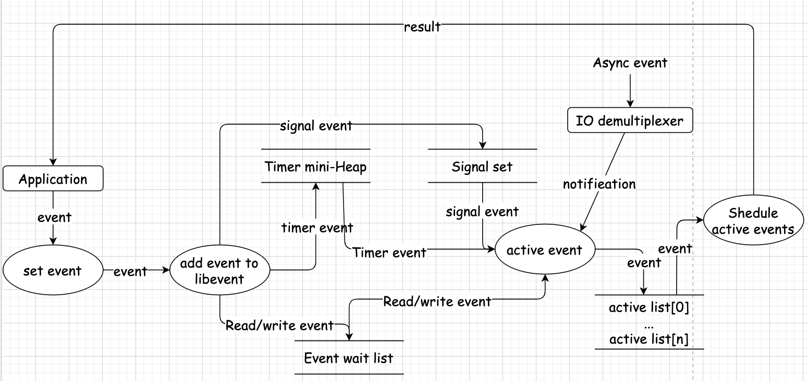
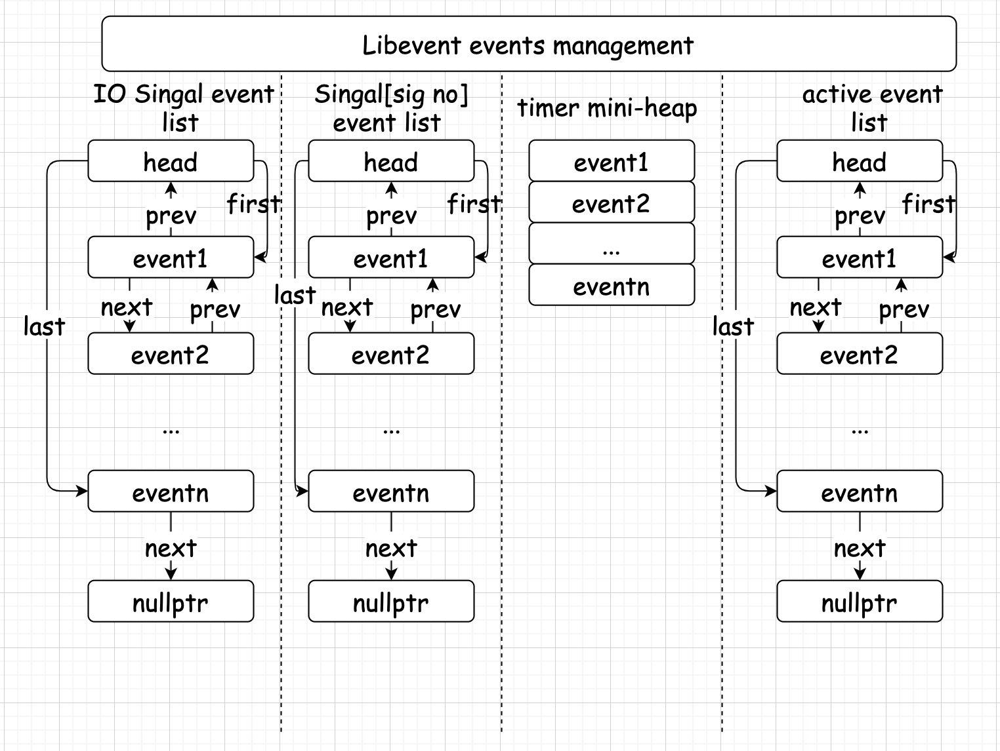

## `libevent`分析

### `libevent`基本流程

1. 初始化`libevent`, 并保存返回的指针：

   ```cpp
    struct event_base *base = event_init();
   ```

   本质上是初始化`Reactor`实例，在初始化`libevent`之后就可以注册事件；

2. 初始化事件`event`, 设置回调函数和关注的事件：

   ```cpp
    evtimer_set(&ev, timer_cb, NULL);
   ```

   等价调用

   ```cpp
    event_set(&ev, -1, 0, timer_cb, NULL);
   ```

   函数原型为：

   ```cpp
    void event_set(struct event *ev, // 执行要初始化的 event 对象
        int fd, // 该 event 绑定的句柄，对信号事件，为关注信号
        short event, // 该 fd 关注的事件类型
        void (*cb)(int, short, void *), // 发生事件时调用的参数
        void *arg); // 传递给 cb 函数指针的参数
   ```

3. 设置`event`从属的`event_base`

   ```cpp
    event_base_set(base , &ev);
   ```

   指明`event`要注册到哪个`event_base`上。

4. 添加事件

   ```cpp
    event_add(&ev, timeout);
   ```

5. 程序进入无限循环，等待就绪事件并执行事件处理。
   ```cpp
    event_base_dispatch(base);
   ```

示例代码：

```cpp
#include <event.h>
#include <event2/event_struct.h>
#include <time.h>

#include <iostream>

struct event   ev;
struct timeval tv;

void time_cb(int fd, short event, void *argc) {
  std::cout << "timer wakeup!" << std::endl;
  event_add(&ev, &tv);
}

int main(int argc, char **argv) {
  struct event_base *base = event_init();
  tv.tv_sec               = 10;
  tv.tv_usec              = 0;
  evtimer_set(&ev, time_cb, NULL);
  event_base_set(base, &ev);
  event_add(&ev, &tv);

  event_base_dispatch(base);
}
```

当应用程序向`libevent`注册一个事件之后，`libevent`处理流程如下：


### 源代码目录结构

Libevent 的源代码都在一层文件夹下面，其代码分类相当清晰的，主要可分为头文件、内部使用的头文件、辅助功能函数、日志、libevent 框架、对系统 I/O 多路复用机制的封装、信号管理、定时事件管理、缓冲区管理、基本数据结构和基于 libevent 的两个实用库等几个部分。

1. 头文件， 主要是`event.h`：事件宏定义，接口函数声明，主要结构体`event`的声明；
2. 内部头文件， `xxx-internal.h`, 内部数据结构与函数，对外不可见，已达到信息隐藏的目的；
3. `libevent event.c`: `event`整体框架的实现；
4. `对系统IO多路复用机制的封装`；
5. 定时事件管理`mini-heap.h`；
6. 信号管理：`signal.c`;
7. 辅助功能函数`evutil.h 和 evutil.c`;
8. 日志函数`log.c 和 log.h`;
9. 缓冲区管理`evbuffer.h 和 evbuffer.c`;
10. 基本数据结构`compat/sys`下的两个源文件；
11. 实用网络库`http和`evdns`。

#### `libevent`的核心--`event`

`event`数据结构定义：

```cpp
struct event {
	struct event_callback ev_evcallback;

   // 时间事件管理使用
	union {
		TAILQ_ENTRY(event) ev_next_with_common_timeout;
		int min_heap_idx; // 小根堆索引
	} ev_timeout_pos;
	evutil_socket_t ev_fd;

	struct event_base *ev_base;

	union {
		// io 事件使用
		struct {
			LIST_ENTRY (event) ev_io_next; // 双向链表
			struct timeval ev_timeout;
		} ev_io;

		// 信号事件使用
		struct {
			LIST_ENTRY (event) ev_signal_next; // 双向链表
			short ev_ncalls;
			/* Allows deletes in callback */
			short *ev_pncalls;
		} ev_signal;
	} ev_;

	short ev_events;
	short ev_res;		/* result passed to event callback */
	struct timeval ev_timeout;
};
```



- 当每次有事件`event`转为就绪状态时，`libevent`将其转移到`active event list[priority]`中，其中`priority`为`event`的优先级；
- `libevent`根据自己的调度策略选择就绪事件，调用去`cb_callback`函数事件执行事件处理，并根据就绪句柄和事件类型填充`cb_callback`函数。

#### 事件设置的接口函数

要向`libevent`添加一个事件，需要首先设置`event`对象。
通过调用`event_set(), event_base_set(), event_priority_set()`.

```cpp
void event_set(struct event *ev,
               int           fd,
               short         events,
               void (*callback)(int, short, void *),
               void *arg);
```

### 事件处理框架`event_base`

`event_base`位于`event_internal.h`中：

```cpp
struct event_base {
	const struct eventop *evsel;
	void *evbase;
	struct event_changelist changelist;

	const struct eventop *evsigsel;
	struct evsig_info sig;

	int virtual_event_count;
	int virtual_event_count_max;
	int event_count;
	int event_count_max;
	int event_count_active;
	int event_count_active_max;

	int event_gotterm;
	int event_break;
	int event_continue;

	int event_running_priority;
	int running_loop;
	int n_deferreds_queued;

	struct evcallback_list *activequeues;
	int nactivequeues;
	struct evcallback_list active_later_queue;

	struct common_timeout_list **common_timeout_queues;
	int n_common_timeouts;
	int n_common_timeouts_allocated;

	struct event_io_map io;

	struct event_signal_map sigmap;

	struct min_heap timeheap;

	struct timeval tv_cache;

	struct evutil_monotonic_timer monotonic_timer;

	struct timeval tv_clock_diff;
	time_t last_updated_clock_diff;

#ifndef EVENT__DISABLE_THREAD_SUPPORT
	unsigned long th_owner_id;
	void *th_base_lock;
	void *current_event_cond;
	int current_event_waiters;
#endif
	struct event_callback *current_event;

#ifdef _WIN32
	struct event_iocp_port *iocp;
#endif

	enum event_base_config_flag flags;

	struct timeval max_dispatch_time;
	int max_dispatch_callbacks;
	int limit_callbacks_after_prio;

	int is_notify_pending;
	evutil_socket_t th_notify_fd[2];
	struct event th_notify;
	int (*th_notify_fn)(struct event_base *base);

	struct evutil_weakrand_state weakrand_seed;

	LIST_HEAD(once_event_list, event_once) once_events;

	struct evwatch_list watchers[EVWATCH_MAX];
};
```
