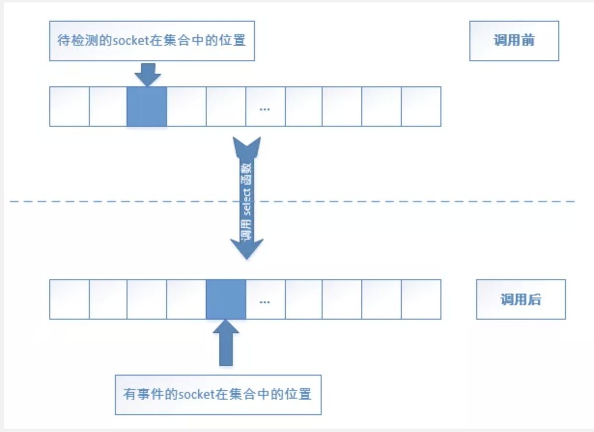
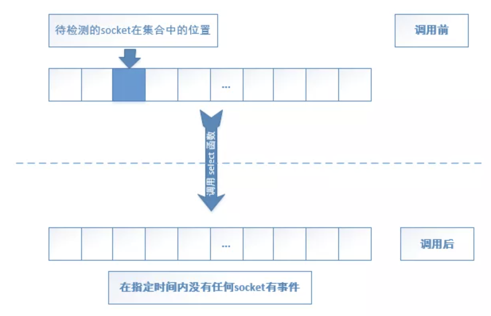
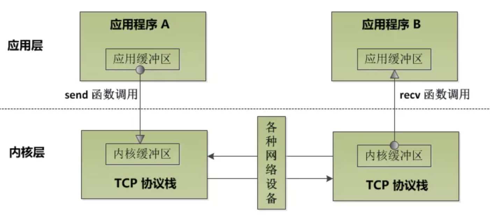
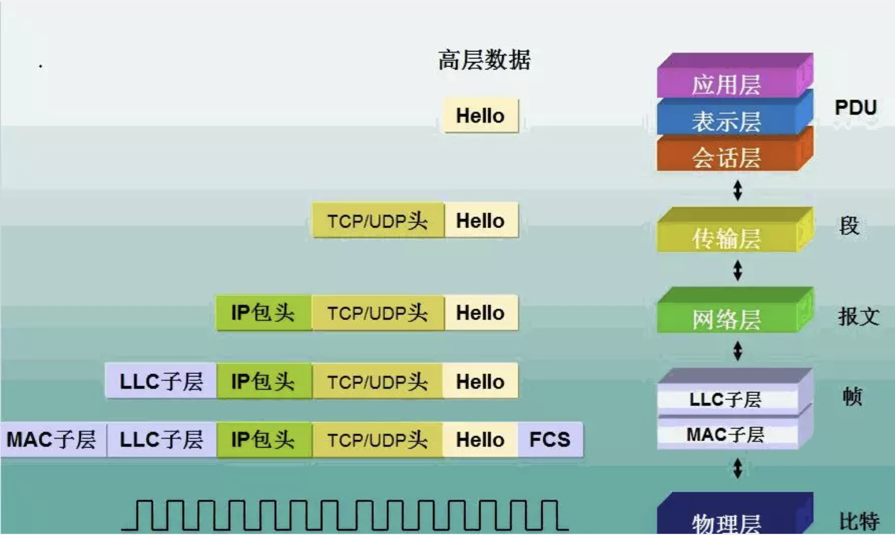

## `bind`函数重难点解析

`bind`函数的基本用法：

```cpp
struct sockaddr_in bindaddr;
bindaddr.sin_family = AF_INET;
bindaddr.sin_addr.s_addr =htonl(INADDR_ANY);
bindaddr.sin_port = htons(3000);

if(-1 == bind(listenfd, (struct sockaddr*)&bindaddr, sizeof(struct bindaddr))) {
  std::cout << "bind listen socket error!" << std::endl;
  return -1;
}
```

`server`服务端代码：

```cpp
#include <arpa/inet.h>
#include <string.h>
#include <sys/socket.h>
#include <sys/types.h>
#include <unistd.h>

#include <iostream>
#include <vector>

int main(int argc, char **argv) {
  // 1. 创建一个侦听的socket
  int listenfd = socket(AF_INET, SOCK_STREAM, 0);

  if (-1 == listenfd) {
    std::cout << "create listen socket error!" << std::endl;
    return -1;
  }

  // 2. 初始化服务器地址
  struct sockaddr_in bindaddr;
  bindaddr.sin_family      = AF_INET;
  bindaddr.sin_addr.s_addr = htonl(INADDR_ANY);
  bindaddr.sin_port        = htons(3000);

  if (-1 == (bind(listenfd,
                  reinterpret_cast<struct sockaddr *>(&bindaddr),
                  sizeof(struct sockaddr)))) {
    std::cout << "bind socket error." << std::endl;
    return -1;
  }

  // 3. 启动侦听
  if (-1 == listen(listenfd, SOMAXCONN)) {
    std::cout << "listen socket error." << std::endl;
    return -1;
  }

  // 记录所有客户端连接的容器
  std::vector<int> clientfds;
  while (true) {
    struct sockaddr_in clientaddr;
    socklen_t          clientaddrlen = sizeof(struct sockaddr_in);

    // 4.接收客户端连接
    int clientfd = accept(listenfd,
                          reinterpret_cast<struct sockaddr *>(&clientaddr),
                          &clientaddrlen);

    if (-1 != clientfd) {
      char recvBuf[32] = {0};
      // 5. 从客户端接收数据
      ssize_t ret = recv(clientfd, recvBuf, 32, 0);
      if (0 < ret) {
        std::cout << "recv data from client, data : " << recvBuf << std::endl;
        // 6. 将收到数据回射给客户端
        ret = send(clientfd, recvBuf, strlen(recvBuf), 0);

        if (static_cast<size_t>(ret) != strlen(recvBuf)) {
          std::cout << "send data error. " << std::endl;
        } else {
          std::cout << "send data to client sucessly. data: " << recvBuf
                    << std::endl;
        }
      } else {
        std::cout << "recv data error." << std::endl;
      }

      clientfds.push_back(clientfd);
    }
  }

  // 7. 关闭侦听socket
  close(listenfd);

  return 0;
}
```

`client`端:

```cpp
#include <arpa/inet.h>
#include <string.h>
#include <sys/socket.h>
#include <sys/types.h>
#include <unistd.h>

#include <iostream>

#define SERVER_ADDR "127.0.0.1"
#define SERVER_PORT 3000
#define SEND_DATA   "Hello World!"

int main(int argc, char **argv) {
  // 1. 创建一个socket
  int clientfd = socket(AF_INET, SOCK_STREAM, 0);
  if (-1 == clientfd) {
    std::cout << "create socket error." << std::endl;
    return -1;
  }

  // 2. 连接服务器
  struct sockaddr_in serveraddr;
  serveraddr.sin_family      = AF_INET;
  serveraddr.sin_addr.s_addr = inet_addr(SERVER_ADDR);
  serveraddr.sin_port        = htons(SERVER_PORT);

  if (-1 == (connect(clientfd,
                     reinterpret_cast<struct sockaddr *>(&serveraddr),
                     sizeof(serveraddr)))) {
    std::cout << "connect socket error." << std::endl;
    return -1;
  }

  // 3. 向服务器发送数据
  ssize_t ret = send(clientfd, SEND_DATA, strlen(SEND_DATA), 0);
  if (ret != strlen(SEND_DATA)) {
    std::cout << "send data error" << std::endl;
    return -1;
  }

  std::cout << "send data sucessly, data : " << SEND_DATA << std::endl;

  // 4. 从服务端接收数据
  char recvBuf[32] = {0};
  ret              = recv(clientfd, recvBuf, 32, 0);
  if (ret > 0) {
    std::cout << "recv data sucessly, data : " << recvBuf << std::endl;
  } else {
    std::cout << "recv data error, data : " << recvBuf << std::endl;
  }

  // 5. 关闭socket
  // close(clientfd);
  while (true) {
    sleep(2);
  }

  return 0;
}
```

在`client`中调用`bind`函数，如果端口设置为`0`效果与未绑定端口相同。

```cpp
#include <arpa/inet.h>
#include <string.h>
#include <sys/socket.h>
#include <sys/types.h>
#include <unistd.h>

#include <iostream>

#define SERVER_ADDR "127.0.0.1"
#define SERVER_PORT 3000
#define SEND_DATA   "Hello World!"

int main(int argc, char **argv) {
  // 1. 创建一个socket
  int clientfd = socket(AF_INET, SOCK_STREAM, 0);
  if (-1 == clientfd) {
    std::cout << "create socket error." << std::endl;
    return -1;
  }

  // 调用bind
  struct sockaddr_in bindaddr;
  bindaddr.sin_family      = AF_INET;
  bindaddr.sin_addr.s_addr = htonl(INADDR_ANY);
  bindaddr.sin_port        = htons(0);

  if (-1 == bind(clientfd,
                 reinterpret_cast<struct sockaddr *>(&bindaddr),
                 sizeof(struct sockaddr))) {
    std::cout << "bind socket error" << std::endl;
    return -1;
  }

  // 2. 连接服务器
  struct sockaddr_in serveraddr;
  serveraddr.sin_family      = AF_INET;
  serveraddr.sin_addr.s_addr = inet_addr(SERVER_ADDR);
  serveraddr.sin_port        = htons(SERVER_PORT);

  if (-1 == (connect(clientfd,
                     reinterpret_cast<struct sockaddr *>(&serveraddr),
                     sizeof(serveraddr)))) {
    std::cout << "connect socket error." << std::endl;
    return -1;
  }

  // 3. 向服务器发送数据
  ssize_t ret = send(clientfd, SEND_DATA, strlen(SEND_DATA), 0);
  if (ret != strlen(SEND_DATA)) {
    std::cout << "send data error" << std::endl;
    return -1;
  }

  std::cout << "send data sucessly, data : " << SEND_DATA << std::endl;

  // 4. 从服务端接收数据
  char recvBuf[32] = {0};
  ret              = recv(clientfd, recvBuf, 32, 0);
  if (ret > 0) {
    std::cout << "recv data sucessly, data : " << recvBuf << std::endl;
  } else {
    std::cout << "recv data error, data : " << recvBuf << std::endl;
  }

  // 5. 关闭socket
  // close(clientfd);
  while (true) {
    sleep(2);
  }

  return 0;
}
```

当绑定到指定端口时，仅能启动一个服务实例。

```cpp
#include <arpa/inet.h>
#include <string.h>
#include <sys/socket.h>
#include <sys/types.h>
#include <unistd.h>

#include <iostream>

#define SERVER_ADDR "127.0.0.1"
#define SERVER_PORT 3000
#define SEND_DATA   "Hello World!"

int main(int argc, char **argv) {
  // 1. 创建一个socket
  int clientfd = socket(AF_INET, SOCK_STREAM, 0);
  if (-1 == clientfd) {
    std::cout << "create socket error." << std::endl;
    return -1;
  }

  // 调用bind
  struct sockaddr_in bindaddr;
  bindaddr.sin_family      = AF_INET;
  bindaddr.sin_addr.s_addr = htonl(INADDR_ANY);
  bindaddr.sin_port        = htons(2000);

  if (-1 == bind(clientfd,
                 reinterpret_cast<struct sockaddr *>(&bindaddr),
                 sizeof(struct sockaddr))) {
    std::cout << "bind socket error" << std::endl;
    return -1;
  }

  // 2. 连接服务器
  struct sockaddr_in serveraddr;
  serveraddr.sin_family      = AF_INET;
  serveraddr.sin_addr.s_addr = inet_addr(SERVER_ADDR);
  serveraddr.sin_port        = htons(SERVER_PORT);

  if (-1 == (connect(clientfd,
                     reinterpret_cast<struct sockaddr *>(&serveraddr),
                     sizeof(serveraddr)))) {
    std::cout << "connect socket error." << std::endl;
    return -1;
  }

  // 3. 向服务器发送数据
  ssize_t ret = send(clientfd, SEND_DATA, strlen(SEND_DATA), 0);
  if (ret != strlen(SEND_DATA)) {
    std::cout << "send data error" << std::endl;
    return -1;
  }

  std::cout << "send data sucessly, data : " << SEND_DATA << std::endl;

  // 4. 从服务端接收数据
  char recvBuf[32] = {0};
  ret              = recv(clientfd, recvBuf, 32, 0);
  if (ret > 0) {
    std::cout << "recv data sucessly, data : " << recvBuf << std::endl;
  } else {
    std::cout << "recv data error, data : " << recvBuf << std::endl;
  }

  // 5. 关闭socket
  // close(clientfd);
  while (true) {
    sleep(2);
  }

  return 0;
}
```

**总结：**

1. `client`可以调用`bind`函数；
2. 当`client`绑定端口为`0`时，与未调用`bind`函数效果相同；
3. 当`client`绑定端口非`0`时，仅能通过指定端口与服务端通信。

## `connect`函数在阻塞与非阻塞模式下的行为

**在`socket`的阻塞模式下，`connect`会一直到有明确的结果才会返回.**
在实际项目中，更多的使用异步的方式进行`connect`:

```
1. 创建socket, 并将socket设置成非阻塞模式；
2. 调用connect函数，无论connect是否成功立即返回，如果返回-1，并不代表链接出错，此时错误码为`EINPROGRESS`;
3. 接着调用select函数，在指定的时间内判断该函数是否可写，如果可写则表示连接成功，否则链接失败。
```

过程如下：

```cpp
#include <arpa/inet.h>
#include <errno.h>
#include <fcntl.h>
#include <netinet/in.h>
#include <stdio.h>
#include <string.h>
#include <sys/socket.h>
#include <sys/types.h>
#include <unistd.h>

#include <iostream>

#define SERVER_ADDRESS "127.0.0.1"
#define SERVER_PORT    3000
#define SEND_DATA      "Hello World!"

int main(int argc, char **argv) {
  // 1. 创建一个socket
  int clientfd = socket(AF_INET, SOCK_STREAM, 0);

  if (-1 == clientfd) {
    std::cout << "create socket error." << std::endl;
    return -1;
  }

  // 创建成功后设置clientfd为非阻塞，如果创建时设置会影响connect的行为
  int oldSocketFlag = fcntl(clientfd, F_GETFL, 0);
  int newSocketFlag = oldSocketFlag | O_NONBLOCK;

  if (-1 == fcntl(clientfd, F_SETFL, newSocketFlag)) {
    close(clientfd);
    std::cout << "set socket to nonblock error." << std::endl;
    return -1;
  }

  // 2. 链接服务器
  struct sockaddr_in server_addr;
  server_addr.sin_family      = AF_INET;
  server_addr.sin_addr.s_addr = inet_addr(SERVER_ADDRESS);
  server_addr.sin_port        = htons(SERVER_PORT);

  for (;;) {
    int ret = connect(clientfd,
                      reinterpret_cast<struct sockaddr *>(&server_addr),
                      sizeof(struct sockaddr));
    if (0 == ret) {
      std::cout << "connect to server sucessly." << std::endl;
      close(clientfd);
      return 0;
    } else if (-1 == ret) {
      if (EINTR == errno) {
        // connect 被信号中断，重试connect
        std::cout << "connecting interruptted by signal, try again."
                  << std::endl;
        continue;
      } else if (EINPROGRESS == errno) {
        // 连接建立中
        break;
      } else {
        close(clientfd);
        return -1;  // 出错
      }
    }
  }

  fd_set writeset;
  FD_ZERO(&writeset);
  FD_SET(clientfd, &writeset);

  // 可以利用tv_time和tv_utime做精细控制
  struct timeval tv;
  tv.tv_sec  = 3;
  tv.tv_usec = 0;

  // 不可直接检测是否可写，对linux与windows来说，
  // 一个socket未建立连接,也可以得到可写的结果
  if (1 != select(clientfd + 1, NULL, &writeset, NULL, &tv)) {
    std::cout << "[select] connect to server error." << std::endl;
    close(clientfd);
    return -1;
  }

  int       err;
  socklen_t len = static_cast<socklen_t>(sizeof err);
  if (0 > ::getsockopt(clientfd, SOL_SOCKET, SO_ERROR, &err, &len)) {
    close(clientfd);
    return -1;
  }

  if (0 == err) {
    std::cout << "connect to server successfully." << std::endl;
  } else {
    std::cout << "connect to server error." << std::endl;
  }

  close(clientfd);
  return 0;
}
```

## `select`函数重难点解析

检测一组`socket`中某个或某几个是否有"事件"，这里的"事件"主要是指：

1. 可读事件，一般可以意味着调用`recv和read`从该`socket`读取数据; 如果这个`socket`是侦听`socket`(调用了`bind`函数，绑定过`ip和端口号`，并调用了`listen`启动侦听的`socket`), 可读意味着此时存在新的客户端连接到来，此时可以调用`accept`函数来接受新的链接。
2. 可写事件，一般意味着此时调用`write或send`函数将数据发送出去；
3. 异常事件，某个`socket`发生异常。

函数签名如下：

```cpp
int select(
  int nfds, // select 需要监听的最大fd数目+1， 类似定义的数组大小
  fd_set *readfds, // 需要监听可读事件fd的集合
  fd_set *writefds, // 需要监听可写事件fd的集合
  fd_set *exceptfds, // 需要监听异常事件的fd集合
  struct timeval *timeout // 超时时间设置
);
```

`readfds, writefds和exceptfds`的类型是`fd_set`, 定义在`/usr/include/sys/select.h`:

```cpp
typedef struct {
  long int __fd_bits[16]; // 可以看成一个128bit的数组
}fd_set;
```

将一个`fd`添加到`fd_set`需要调用`FD_SET`宏：

```cpp
void FD_SET(int fd, fd_set *set);
```

其实现为：

```cpp
#define FD_SET(fd, fdsetp) __FD_SET(fd, fdsetp)
```

`timeout`为`select`等待的超时时间，定义如下：

```cpp
struct timeval{
  long tv_sec;
  logn tv_usec;
};
```

示例：

```cpp
#include <arpa/inet.h>
#include <errno.h>
#include <string.h>
#include <sys/socket.h>
#include <sys/time.h>
#include <sys/types.h>
#include <unistd.h>

#include <iostream>
#include <vector>

// 自定义代表无效的FD值
#define INVALID_FD -1

int main(int argc, char **argv) {
  // 创建一个侦听socket
  int listenfd = socket(AF_INET, SOCK_STREAM, 0);

  if (-1 == listenfd) {
    std::cout << "create socket error!" << std::endl;
    return -1;
  }

  // 初始化服务器地址
  struct sockaddr_in bindaddr;
  bindaddr.sin_family      = AF_INET;
  bindaddr.sin_addr.s_addr = htonl(INADDR_ANY);
  bindaddr.sin_port        = htons(3000);

  if (-1 == bind(listenfd,
                 reinterpret_cast<struct sockaddr *>(&bindaddr),
                 sizeof(struct sockaddr))) {
    std::cout << "bind socket error" << std::endl;
    close(listenfd);
    return -1;
  }

  // 启动侦听
  if (-1 == listen(listenfd, SOMAXCONN)) {
    std::cout << "listen socket error" << std::endl;
    close(listenfd);
    return -1;
  }

  // 存储客户端socket数据
  std::vector<int> clientfds;
  int              maxfd = listenfd;

  while (true) {
    fd_set readset;
    FD_ZERO(&readset);

    // 将侦听socket加入到待检测的可读事件中
    FD_SET(listenfd, &readset);

    // 将客户端fd加入到待检测的可读事件中去
    unsigned long clientfdslength = clientfds.size();
    for (unsigned long i = 0; i < clientfdslength; i++) {
      if (INVALID_FD != clientfds[i]) {
        FD_SET(clientfds[i], &readset);
      }
    }

    timeval tv;
    tv.tv_sec  = 1;
    tv.tv_usec = 0;

    // 只检测可读事件
    int ret = select(maxfd + 1, &readset, nullptr, nullptr, &tv);

    if (-1 == ret) {
      // 出错，退出程序
      if (EINTR != errno) {
        break;
      }
    } else if (0 == ret) {
      // select 函数超时，下次继续
      continue;
    } else {
      // 检测到某个socket有事件
      if (FD_ISSET(listenfd, &readset)) {
        // 侦听到socket可读事件，则表示有新的链接到来
        struct sockaddr_in clientaddr;
        socklen_t          clientaddrlen = sizeof(clientaddr);

        // 接受客户端连接
        int clientfd = accept(listenfd,
                              reinterpret_cast<struct sockaddr *>(&clientaddr),
                              &clientaddrlen);
        if (-1 == clientfd) {
          // 连接出错，直接返回
          break;
        }

        // 只接受连接不接受任何数据
        std::cout << "accept a client connection, fd: " << clientfd
                  << std::endl;
        clientfds.push_back(clientfd);

        // 记录下最新的最大maxfd，方便后续更新
        maxfd = maxfd > clientfd ? maxfd : clientfd;
      } else {
        // 假设对端发来的数据不超过64
        char          recvbuf[64];
        unsigned long clientfdslen = clientfds.size();

        for (unsigned long i = 0; i < clientfdslen; i++) {
          if (-1 != clientfds[i] && FD_ISSET(clientfds[i], &readset)) {
            memset(recvbuf, 0, sizeof(recvbuf));
            // 非侦听socket，继续接受数据
            ssize_t recvlen = recv(clientfds[i], recvbuf, 64, 0);
            if (recvlen <= 0 && errno != EINTR) {
              // 收取数据出错
              std::cout << "recv data error, clientfd " << clientfds[i]
                        << std::endl;
              close(clientfds[i]);
              // 不直接删除该元素，将当前位置置为INVALID
              clientfds[i] = INVALID_FD;
              continue;
            }

            std::cout << "clientfd : " << clientfds[i] << " recv data is "
                      << recvbuf << std::endl;
          }
        }
      }
    }
  }

  // 关闭所有客户端
  unsigned long clientfdslength = clientfds.size();
  for (unsigned long i = 0; i < clientfdslength; i++) {
    if (INVALID_FD != clientfds[i]) {
      close(clientfds[i]);
    }
  }

  close(listenfd);

  return 0;
}
```

当客户端断开连接时，服务器端`select`函数对各个客户端`fd`检测时，也会触发可读事件，
此时对这些`fd`调用`recv`函数会返回`0`(`recv`函数返回 0，表示对端关闭连接)，服务端也可以关闭这些连接.
`select`用在`client`：

```cpp
#include <arpa/inet.h>
#include <errno.h>
#include <string.h>
#include <sys/socket.h>
#include <sys/types.h>
#include <unistd.h>

#include <iostream>

#define SERVER_ADDR "127.0.0.1"
#define SERVER_PORT 3000

int main(int argc, char **argv) {
  // 创建一个socket
  int clientfd = socket(AF_INET, SOCK_STREAM, 0);
  if (-1 == clientfd) {
    std::cout << "create socket error" << std::endl;
    return -1;
  }

  // 连接服务器
  struct sockaddr_in serveraddr;
  serveraddr.sin_family      = AF_INET;
  serveraddr.sin_addr.s_addr = inet_addr(SERVER_ADDR);
  serveraddr.sin_port        = htons(SERVER_PORT);

  // 连接服务器
  if (-1 == connect(clientfd,
                    reinterpret_cast<struct sockaddr *>(&serveraddr),
                    sizeof(serveraddr))) {
    std::cout << "connect error " << std::endl;
    close(clientfd);
    return -1;
  }

  fd_set readset;
  FD_ZERO(&readset);

  // 将侦听socket加入到待检测的可读事件中去
  FD_SET(clientfd, &readset);
  timeval tv;
  tv.tv_sec  = 5;
  tv.tv_usec = 0;
  int    ret;
  int    count = 0;
  fd_set backup_readset;

  memcpy(&backup_readset, &readset, sizeof(readset));

  while (true) {
    if (0 == memcmp(&readset, &backup_readset, sizeof(readset))) {
      std::cout << "equal" << std::endl;
    } else {
      std::cout << "Not equal" << std::endl;
    }

    // 暂且只检测可读事件
    ret = select(clientfd + 1, &readset, nullptr, nullptr, &tv);
    std::cout << "tv.tv_sec : " << tv.tv_sec << ", tv.tv_usec : " << tv.tv_usec
              << std::endl;

    if (-1 == ret) {
      // 被中断信号的情况，其余情况均为出错
      if (EINTR == errno) {
        break;
      }
    } else if (0 == ret) {
      // select 函数超时
      std::cout << "no event in specific time interval, count：" << count
                << std::endl;
      ++count;
      continue;
    } else {
      if (FD_ISSET(clientfd, &readset)) {
        // 检测到可读事件
        char buf[32];
        memset(&buf, 0, sizeof(buf));

        ssize_t n = recv(clientfd, &buf, 32, 0);
        if (n < 0) {
          // 除了信号被中断情况，其余情况均为出错
          if (EINTR != errno) {
            break;
          }
        } else if (0 == n) {
          // 对端关闭了连接
          break;
        } else {
          std::cout << "recv data: " << buf << std::endl;
        }
      } else {
        std::cout << "other socket event" << std::endl;
      }
    }
  }

  // 关闭socket
  close(clientfd);
  return 0;
}
```

上述代码，在执行`select`之后，返回均为超时。
`select`修改`fd_set`如下图：


**在调用`select`之后，原来位置的标志位已经不存在。**
**`select`函数会修改`timeval`结构体的值，如果需要复用改对象，需要重新设置值。**
**`select`函数会将`timeval`设置为 0，其行为为检测相关集合中的`fd`，如果没有需要事件立刻返回。**
可以修改为如下：

```cpp
#include <arpa/inet.h>
#include <errno.h>
#include <string.h>
#include <sys/socket.h>
#include <sys/types.h>
#include <unistd.h>

#include <iostream>

#define SERVER_ADDR "127.0.0.1"
#define SERVER_PORT 3000

int main(int argc, char **argv) {
  // 创建一个socket
  int clientfd = socket(AF_INET, SOCK_STREAM, 0);
  if (-1 == clientfd) {
    std::cout << "create socket error" << std::endl;
    return -1;
  }

  // 连接服务器
  struct sockaddr_in serveraddr;
  serveraddr.sin_family      = AF_INET;
  serveraddr.sin_addr.s_addr = inet_addr(SERVER_ADDR);
  serveraddr.sin_port        = htons(SERVER_PORT);

  // 连接服务器
  if (-1 == connect(clientfd,
                    reinterpret_cast<struct sockaddr *>(&serveraddr),
                    sizeof(serveraddr))) {
    std::cout << "connect error " << std::endl;
    close(clientfd);
    return -1;
  }

  int ret;
  int count = 0;

  while (true) {
    fd_set readset;
    FD_ZERO(&readset);

    // 将侦听socket加入到待检测的可读事件中去
    FD_SET(clientfd, &readset);
    timeval tv;
    tv.tv_sec  = 5;
    tv.tv_usec = 0;
    // 暂且只检测可读事件
    ret = select(clientfd + 1, &readset, nullptr, nullptr, &tv);
    std::cout << "tv.tv_sec : " << tv.tv_sec << ", tv.tv_usec : " << tv.tv_usec
              << std::endl;

    if (-1 == ret) {
      // 被中断信号的情况，其余情况均为出错
      if (EINTR == errno) {
        break;
      }
    } else if (0 == ret) {
      // select 函数超时
      std::cout << "no event in specific time interval, count：" << count
                << std::endl;
      ++count;
      continue;
    } else {
      if (FD_ISSET(clientfd, &readset)) {
        // 检测到可读事件
        char buf[32];
        memset(&buf, 0, sizeof(buf));

        ssize_t n = recv(clientfd, &buf, 32, 0);
        if (n < 0) {
          // 除了信号被中断情况，其余情况均为出错
          if (EINTR != errno) {
            break;
          }
        } else if (0 == n) {
          // 对端关闭了连接
          break;
        } else {
          std::cout << "recv data: " << buf << std::endl;
        }
      } else {
        std::cout << "other socket event" << std::endl;
      }
    }
  }

  // 关闭socket
  close(clientfd);
  return 0;
}

```

## `EPOLL`模型

要想使用`epoll`模型，需要先创建一个`epollfd`：

```cpp
#include <sys/epoll.h>

int epoll_create(int size);
int epoll_ctl(int epfd, int op, int fd, struct epoll_event *event);
```

`epoll_event`结构定义如下：

```cpp
struct epoll_event{
  uint32_t events; // 需要检测的fd 事件
  epoll_data_t data; // 用户自定义数据
};
```

`epoll_data_t`为一个`union`结构，其定义如下：

```cpp
typedef union epoll_data{
  void *ptr;
  int fd;
  uint32_t u32;
  uint64_t u64;
}epoll_data_t;
```

使用`epoll_wait`检测事件：

```cpp
int epoll_wait(int epfd, struct epoll_event *events, int maxevents, int timeout);
```

## `socket`的阻塞与非阻塞模式

### 如何将`socket`设置为非阻塞模式

默认情况下， `socket`为阻塞模式。
在`linux`平台通过`fcntl和ioctl`函数给创建的`socket`增加`O_NONBLOCK`标识来将`socket`设置成非阻塞的模式。

```cpp
int oldSocketFlag = fcntl(sockfd, F_GETFL,0);
int newSocketFlag = oldSocketFlag | O_NONBLOCK;
fcntl(sockfd, F_SETFL, newSocketFlag);
```

`linux`下在`socket`创建函数下，可以直接设置成`N_NONBLOCK`:

```cpp
int socket(int domain, int type, int protocol);
int s = socket(AF_INET, SOCK_STREAM|SOCK_NONBLOCK, IPPROTO_TCP);
```

或者在使用`accept4`函数时，将`flags`设置为`SOCK_NONBLOCK`.


有如下结论：

1. 当`socket`为阻塞式，将会阻塞在`send/recv`处；
2. 当`socket`为非阻塞式，调用`send/recv`不会阻塞程序流程，会立刻返回错误。`linux`错误码为`EWOULDBLOCK或EAGAIN`, `windows`错误码为`WSAEWOULDBLOCK`.
   `block server`:

```cpp
#include <arpa/inet.h>
#include <netinet/in.h>
#include <string.h>
#include <sys/socket.h>
#include <sys/types.h>
#include <unistd.h>

#include <iostream>

int main(int argc, char **argv) {
  // 创建一个侦听socket
  int listenfd = socket(AF_INET, SOCK_STREAM, 0);

  if (-1 == listenfd) {
    std::cout << "create socket error!" << std::endl;
    return -1;
  }

  // 初始化服务器地址
  struct sockaddr_in serveraddr;
  serveraddr.sin_family      = AF_INET;
  serveraddr.sin_addr.s_addr = htonl(INADDR_ANY);
  serveraddr.sin_port        = htons(3000);

  if (-1 == bind(listenfd,
                 reinterpret_cast<struct sockaddr *>(&serveraddr),
                 sizeof(serveraddr))) {
    std::cout << "bind socket error!" << std::endl;
    close(listenfd);
    return -1;
  }

  // 启动侦听
  if (-1 == listen(listenfd, SOMAXCONN)) {
    std::cout << "listen error" << std::endl;
    close(listenfd);
    return -1;
  }

  while (true) {
    struct sockaddr_in clientaddr;
    socklen_t          socklen = sizeof(clientaddr);

    // 接受客户端连接
    int clientfd = accept(listenfd,
                          reinterpret_cast<struct sockaddr *>(&clientaddr),
                          &socklen);
    if (-1 != clientfd) {
      std::cout << "accept a client connection, clientfd: " << clientfd
                << std::endl;
    }
  }

  close(listenfd);

  return 0;
}

```

`block client`:

```cpp
#include <arpa/inet.h>
#include <netinet/in.h>
#include <string.h>
#include <sys/socket.h>
#include <sys/types.h>
#include <unistd.h>

#include <iostream>

#define SERVER_ADDR "127.0.0.1"
#define SERVER_PORT 3000
#define SEND_DATA   "Hello World!"

int main(int argc, char **argv) {
  // 创建一个socket
  int clientfd = socket(AF_INET, SOCK_STREAM, 0);
  if (-1 == clientfd) {
    std::cout << "create socket error" << std::endl;
    return -1;
  }

  // 连接服务器
  struct sockaddr_in serveraddr;
  serveraddr.sin_family      = AF_INET;
  serveraddr.sin_addr.s_addr = inet_addr(SERVER_ADDR);
  serveraddr.sin_port        = ntohs(SERVER_PORT);

  if (-1 == connect(clientfd,
                    reinterpret_cast<struct sockaddr *>(&serveraddr),
                    sizeof(serveraddr))) {
    std::cout << "connect error!" << std::endl;
    close(clientfd);
    return -1;
  }

  // 向服务器不断发送数据或出错退出
  int count = 0;
  while (true) {
    ssize_t ret = send(clientfd, SEND_DATA, strlen(SEND_DATA), 0);
    if (ret != strlen(SEND_DATA)) {
      std::cout << "send data error " << std::endl;
      break;
    } else {
      ++count;
      std::cout << "send data successly , count = " << count << std::endl;
    }
  }

  close(clientfd);
  return 0;
}

```

## 服务器开发通信协议介绍


`TCP`防止粘包：

1. 通过固定大小的字节数目来分界；
2. 以特定的符号分界；
3. 固定包头+包体结构，包头部分是一个固定字节长度的结构，并且包头中有一个特定的结构标识包的长度。
