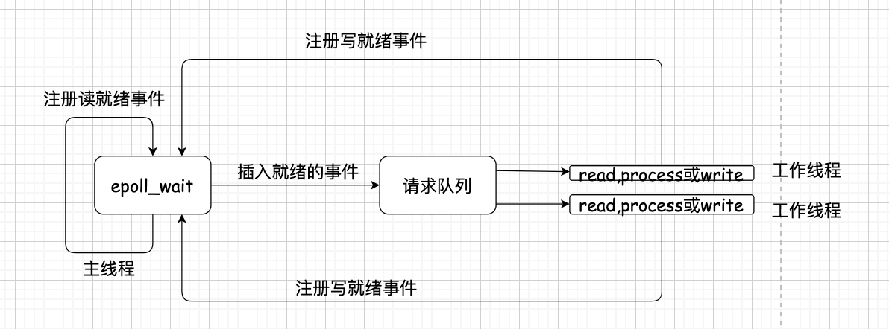

## 主线程与工作线程分工

服务器为了能够流畅的处理多个客户端连接，一般在线程 A(主线程) `accept`新的线程连接，并生成新的连接`socketfd`, 然后将这些新的`socketfd`交给另外开的数个工作线程 B1，B2， B3 等进行处理。
工作线程的框架代码为：

```cpp
while(!m_bQuit) {
  epoll_or_select_func();
  handle_io_events();
  handler_other_things();
}
```

在`epoll_or_selec_func`函数中，在没有网络 IO 和其他任务要处理时，线程挂起，避免空转。
采用以下的方式：

1. `Linux`中无论`epoll_fd`上是否存在`fd`, 我们都将其绑定到一个默认的`fd`上，称为唤醒`fd`；
2. 当我们需要处理其他任务时，向这个`fd`上写入`1`字节数据，将其变为可读。这样`select/poll/epoll`立刻返回，执行其他任务。

唤醒`fd`的实现有以下方式：

1. 管道(`pipe`), 创建一个管道，将管道绑定到`epoll_fd`上。需要时，向管道的一端写入一个字节，工作线程立刻被唤醒；
2. 利用`eventfd`函数

```cpp
int eventfd(unsigned int initval, int flags);
```

3. 利用`socketpair`

```cpp
int socketpair(int domain, int type, int protocol, int sv[2]);
```

调用这个函数返回的两个 `socket` 句柄就是` sv[0]，和 sv[1]`，在一个其中任何一个写入字节，在另外一个收取字节。
将收取的字节的 `socket` 绑定到 `epoll_fd` 上。需要时，向另外一个写入的 `socket` 上写入一个字节，工作线程立即被唤醒。如果是使用 `socketpair`，那么 `domain` 参数一定要设置成 `AFX_UNIX`.

## `Reactor`模式

主线程(`IO`处理单元)只负责监听文件描述符上是否有事件发生，有事件发生立刻通知工作线程(逻辑处理单元)。除此之外，工作线程不做任何工作。
`Reactor`工作流：

1. 主线程向`epoll`内核事件中注册`socket`上的可读事件；
2. 主线程调用`epoll_wait`等待`socket`上有数据可读；
3. 当`socket`上有数据可读时，`epoll_wait`通知主线程。主线程将`socket`可读事件放到请求队列。
4. 睡眠在请求队列的某个工作线程被唤醒，从`socket`读取数据，处理客户请求，然后向`epoll`内核注册该`socket`的写就绪事件；
5. 主线程调用`epoll_wait`等待`socket`可写；
6. 当`socket`可写时，`epoll_wait`通知主线程，主线程将`socket`可写事件放入到请求队列；
7. 睡眠在请求队列的某个工作线程被唤醒，往`socket`写入服务端处理客户请求的结果。
   

示例：

```cpp
#include <arpa/inet.h>
#include <errno.h>
#include <fcntl.h>
#include <netinet/in.h>
#include <pthread.h>
#include <semaphore.h>
#include <signal.h>
#include <stdlib.h>
#include <string.h>
#include <sys/epoll.h>
#include <sys/socket.h>
#include <sys/types.h>
#include <time.h>
#include <unistd.h>

#include <cstddef>
#include <iomanip>
#include <iostream>
#include <list>
#include <sstream>

#define WORK_THREAD_NUM 5

#define min(a, b) (a <= b ? (a) : (b))
int             g_epollfd                   = 0;
bool            g_bStop                     = false;
int             g_listenfd                  = 0;
pthread_t       g_acceptthreadid            = 0;
pthread_t       g_threadid[WORK_THREAD_NUM] = {0};
pthread_cond_t  g_acceptcond;
pthread_mutex_t g_acceptmutex;

pthread_cond_t  g_cond;
pthread_mutex_t g_mutex;

pthread_mutex_t g_clientmutex;
std::list<int>  g_listClients;

void prog_exit(int signo) {
  ::signal(SIGINT, SIG_IGN);
  ::signal(SIGTERM, SIG_IGN);

  std::cout << "program recv signal " << signo << " to exit." << std::endl;

  g_bStop = true;
  epoll_ctl(g_epollfd, EPOLL_CTL_DEL, g_listenfd, 0);

  ::shutdown(g_listenfd, SHUT_RDWR);
  ::close(g_epollfd);
  ::close(g_listenfd);

  ::pthread_cond_destroy(&g_acceptcond);
  ::pthread_mutex_destroy(&g_acceptmutex);

  ::pthread_cond_destroy(&g_cond);
  ::pthread_mutex_destroy(&g_mutex);

  ::pthread_mutex_destroy(&g_clientmutex);
}

bool create_server_listen(const char *ip, short port) {
  g_listenfd = ::socket(AF_INET, SOCK_STREAM | SOCK_NONBLOCK, 0);
  if (-1 == g_listenfd) {
    return false;
  }

  int on = 1;
  ::setsockopt(g_listenfd,
               SOL_SOCKET,
               SO_REUSEADDR,
               reinterpret_cast<char *>(&on),
               sizeof(on));
  ::setsockopt(g_listenfd,
               SOL_SOCKET,
               SO_REUSEPORT,
               reinterpret_cast<char *>(&on),
               sizeof(on));

  struct sockaddr_in serveraddr;
  memset(&serveraddr, 0, sizeof(serveraddr));
  serveraddr.sin_family      = AF_INET;
  serveraddr.sin_addr.s_addr = inet_addr(ip);
  serveraddr.sin_port        = htons(port);

  if (-1 == ::bind(g_listenfd,
                   reinterpret_cast<struct sockaddr *>(&serveraddr),
                   sizeof(struct sockaddr))) {
    return false;
  }

  if (-1 == listen(g_listenfd, 50)) {
    return false;
  }

  g_epollfd = ::epoll_create1(1);

  if (-1 == g_epollfd) {
    return false;
  }

  struct epoll_event epev;
  memset(&epev, 0, sizeof(struct epoll_event));
  epev.events  = EPOLLIN | EPOLLOUT;
  epev.data.fd = g_listenfd;

  if (-1 == epoll_ctl(g_epollfd, EPOLL_CTL_ADD, g_listenfd, &epev)) {
    return false;
  }

  return true;
}

void release_client(int clientfd) {
  if (-1 == epoll_ctl(g_epollfd, EPOLL_CTL_DEL, clientfd, NULL)) {
    std::cout << "release client socket failed as call epoll_ctl failed"
              << std::endl;
  }
  ::close(clientfd);
}

void *accept_thread_func(void *arg) {
  while (!g_bStop) {
    ::pthread_mutex_lock(&g_acceptmutex);
    ::pthread_cond_wait(&g_acceptcond, &g_acceptmutex);

    struct sockaddr_in clientaddr;
    socklen_t          addrlen;
    int                newfd = ::accept(g_listenfd,
                         reinterpret_cast<struct sockaddr *>(&clientaddr),
                         &addrlen);
    ::pthread_mutex_unlock(&g_acceptmutex);

    if (-1 == newfd) {
      continue;
    }

    std::cout << "new client connected : " << ::inet_ntoa(clientaddr.sin_addr)
              << " : " << ::ntohs(clientaddr.sin_port) << std::endl;

    // 将新的socket设置成nonblocking
    int oldflag = ::fcntl(newfd, F_GETFL, 0);
    int newflag = oldflag | O_NONBLOCK;
    if (-1 == ::fcntl(newfd, F_SETFL, newflag)) {
      std::cout << "fcntl error, oldflag =" << oldflag
                << ", newflag = " << newflag << std::endl;
      continue;
    }

    struct epoll_event epev;
    memset(&epev, 0, sizeof(struct epoll_event));
    epev.events  = EPOLLIN | EPOLLRDHUP | EPOLLET;
    epev.data.fd = newfd;

    if (-1 == epoll_ctl(g_epollfd, EPOLL_CTL_ADD, newfd, &epev)) {
      std::cout << "epoll_ctl error, fd =" << newfd << std::endl;
    }
  }

  return nullptr;
}

void *worker_thread_func(void *arg) {
  while (!g_bStop) {
    int clientfd;
    ::pthread_mutex_lock(&g_clientmutex);

    while (g_listClients.empty()) {
      ::pthread_cond_wait(&g_cond, &g_clientmutex);
    }

    clientfd = g_listClients.front();
    g_listClients.pop_front();
    ::pthread_mutex_unlock(&g_clientmutex);

    // gdb
    // 调试不能实时刷新标准输出，使用这个函数刷新标准输出，使得信息实时在屏幕显示
    std::cout << std::endl;

    std::string clientmsg;
    char        buf[256];
    bool        bError = false;

    while (true) {
      memset(buf, 0, sizeof(buf));
      ssize_t nRecv = ::recv(clientfd, buf, 356, 0);

      if (-1 == nRecv) {
        if (EWOULDBLOCK == errno) {
          break;
        } else {
          std::cout << "recv error, client disconnected, fd = " << clientfd
                    << std::endl;
          release_client(clientfd);
          bError = true;
          break;
        }
      } else if (0 == nRecv) {
        // 对端关闭
        std::cout << "peer closed, client disconnected, fd = " << clientfd
                  << std::endl;
        release_client(clientfd);
        bError = true;
        break;
      }
      clientmsg += buf;
    }
    // 出错了，无需继续执行
    if (bError) {
      continue;
    }

    std::cout << "client msg : " << clientmsg << std::endl;

    // 将消息添加时间戳之后返回
    time_t             now    = time(NULL);
    struct tm         *nowstr = localtime(&now);
    std::ostringstream ostimestr;
    ostimestr << "[" << nowstr->tm_year + 1900 << "-" << std::setw(2)
              << std::setfill('0') << nowstr->tm_mon + 1 << std::setw(2)
              << std::setfill('0') << nowstr->tm_mday << " " << std::setw(2)
              << std::setfill('0') << nowstr->tm_hour << ":" << std::setw(2)
              << std::setfill('0') << nowstr->tm_min << ":" << std::setw(2)
              << std::setfill('0') << nowstr->tm_sec << "]server reply: ";
    clientmsg.insert(0, ostimestr.str());

    while (true) {
      ssize_t nSend =
          ::send(clientfd, clientmsg.c_str(), clientmsg.length(), 0);
      if (-1 == nSend) {
        if (EWOULDBLOCK == errno) {
          ::sleep(10);
          continue;
        } else {
          std::cout << "send error, fd = " << clientfd << std::endl;
          release_client(clientfd);
          break;
        }
      }

      std::cout << "send : " << clientmsg;
      clientmsg.erase(0, nSend);

      if (clientmsg.empty()) {
        break;
      }
    }
  }

  return nullptr;
}

void daemon_run() {
  int pid;
  ::signal(SIGCHLD, SIG_IGN);

  // 在父进程中，fork返回新创建的子进程id
  // 在子进程中，fork返回0
  // 如果出现错误，fork返回负值
  pid = fork();
  if (pid < 0) {
    std::cout << "fork error" << std::endl;
    exit(-1);
  } else if (pid > 0) {
    // 父进程退出，子进程独立运行
    exit(0);
  }
  // parent与child运行在同一个session中，parent是会话领头进程
  // parent
  // 作为领头的会话进程，当调用exit结束时，子进程会变成孤儿进程，被init进程接管
  // 执行setsid()之后，child将重新获得一个新的会话(session)id
  // 此时parent退出不会影响child
  setsid();
  int fd;
  fd = open("/dev/null", O_RDWR, 0);

  if (-1 != fd) {
    dup2(fd, STDIN_FILENO);
    dup2(fd, STDOUT_FILENO);
    dup2(fd, STDERR_FILENO);
  }

  if (fd > 2) {
    close(fd);
  }
}

int main(int argc, char **argv) {
  short port = 0;
  int   ch;
  bool  bdaemon = false;

  while (-1 == (ch = getopt(argc, argv, "p:d"))) {
    switch (ch) {
      case 'd':
        bdaemon = true;
        break;
      case 'p':
        port = static_cast<short>(atol(optarg));
        break;
    }
  }

  if (bdaemon) {
    daemon_run();
  }

  if (0 == port) {
    port = 12345;
  }

  if (!create_server_listen("0.0.0.0", port)) {
    std::cout << "Unable to create listen server: ip=0.0.0.0, port=" << port
              << "." << std::endl;
    return -1;
  }

  // 设置信号处理
  ::signal(SIGCHLD, SIG_DFL);
  ::signal(SIGPIPE, SIG_IGN);
  ::signal(SIGINT, prog_exit);
  ::signal(SIGTERM, prog_exit);

  ::pthread_cond_init(&g_acceptcond, NULL);
  ::pthread_mutex_init(&g_acceptmutex, NULL);
  ::pthread_cond_init(&g_cond, NULL);
  ::pthread_mutex_init(&g_mutex, NULL);
  ::pthread_mutex_init(&g_clientmutex, NULL);

  ::pthread_create(&g_acceptthreadid, NULL, accept_thread_func, NULL);

  // 启动工作线程
  for (int i = 0; i < WORK_THREAD_NUM; i++) {
    ::pthread_create(&g_threadid[i], NULL, worker_thread_func, NULL);
  }

  while (!g_bStop) {
    struct epoll_event ev[1024];
    int                n = ::epoll_wait(g_epollfd, ev, 1024, 10);
    if (0 == n) {
      continue;
    } else if (n < 0) {
      std::cout << "epoll_wait error" << std::endl;
      continue;
    }

    int m = min(0, 10);
    for (int i = 0; i < m; i++) {
      // 通知接收进程接收新连接
      if (g_listenfd == ev[i].data.fd) {
        pthread_cond_signal(&g_acceptcond);
      } else {
        // 通知普通工作线程接收数据
        ::pthread_mutex_lock(&g_clientmutex);
        g_listClients.push_back(ev[i].data.fd);
        ::pthread_mutex_unlock(&g_clientmutex);
        ::pthread_cond_signal(&g_cond);
      }
    }
  }

  return 0;
}
```

## 高性能服务器框架设计细节

1. 网络通信部分

- 如何检测有新客户端连接？
- 如何接受客户端连接？
- 如何检测客户端是否有数据发来？
- 如何收取客户端发来的数据？
- 如何检测连接异常？发现连接异常之后，如何处理？
- 如何给客户端发送数据？
- 如何在给客户端发完数据后关闭连接？

a. 接受客户端连接使用`accept`函数；
b. 收取客户端数据用`recv`函数；
c. 向客户端发送数据使用`send`函数；
d. 检测客户端是否有新连接和客户端是否有新数据可以用`IO multiplexing`技术（`IO复用`）的`select、poll、epoll`等`socket API`。

2. `IO`复用技术比较
   - 层次一 `select和poll`
   - 层次二 `WSAAsyncSelect、WSAEventSelect、完成端口（IOCP）、epoll`

`select和poll`函数本质上还是在一定时间内主动去查询 `socket` 句柄（可能是一个也可能是多个）上是否有事件

3. 检测网络事件的正确姿势

   - 为了避免无意义的等待时间;
   - 不采用主动查询各个 socket 的事件，而是采用等待操作系统通知我们有事件的状态的策略。

4. 如何检测连接异常？发现连接异常之后，如何处理？
   当我们收到异常事件后例如 EPOLLERR 或关闭事件 FD_CLOSE，我们就知道了有异常产生，我们对异常的处理一般就是关闭对应的 socket。另外，如果 send/recv 或者 read/write 函数对一个 socket 进行操作时，如果返回 0，那说明对端已经关闭了 socket，此时这路连接也没必要存在了，我们也可以关闭对应的 socket。

5.如何给客户端发送数据？

- 不能像注册检测数据可读事件一样一开始就注册检测数据可写事件，因为如果检测可写的话，一般情况下只要对端正常收取数据，我们的 socket 就都是可写的，如果我们设置监听可写事件，会导致频繁地触发可写事件，但是我们此时并不一定有数据需要发送。
- 正确的做法是：
  - 如果有数据要发送，则先尝试着去发送，如果发送不了或者只发送出去部分，剩下的我们需要将其缓存起来，然后再设置检测该 socket 上可写事件，下次可写事件产生时，再继续发送，如果还是不能完全发出去，则继续设置侦听可写事件，如此往复，一直到所有数据都发出去为止。
  - 一旦所有数据都发出去以后，我们要移除侦听可写事件，避免无用的可写事件通知。
  - 如果某次只发出去部分数据，剩下的数据应该暂且存起来，这个时候我们就需要一个缓冲区来存放这部分数据，这个缓冲区我们称为“发送缓冲区”。
  - 发送缓冲区不仅存放本次没有发完的数据，还用来存放在发送过程中，上层又传来的新的需要发送的数据。
  - 为了保证顺序，新的数据应该追加在当前剩下的数据的后面，发送的时候从发送缓冲区的头部开始发送。也就是说先来的先发送，后来的后发送。

6. 如何在给客户端发完数据后关闭连接？
   - 认为 send 或者 write 返回我们发出数据的字节数大小，我们就认为“发完数据”了。然后调用 close 等 socket API 关闭连接。
